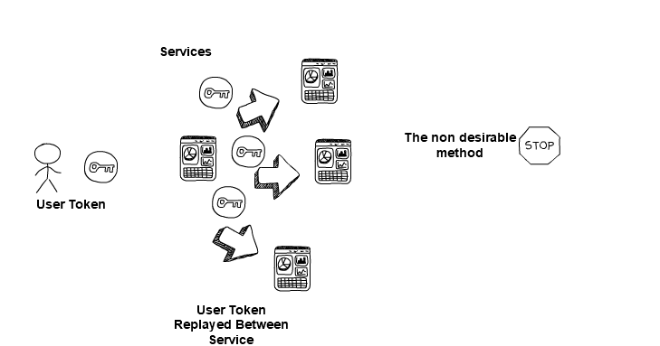
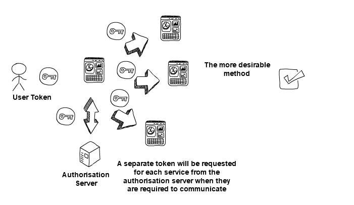

# 2. Know your User, Service and Device identities

In a zero trust architecture, identity becomes the new perimeter. This makes it the one of the most important factors in deciding whether someone or something should be given access to data or services.

It is important to have a single source of identity for each of the following: user (human), service (machine or software process) and device.

### User Identity 

Your organisation should use a single user directory and create accounts that are linked to individuals. Each identity's permissions should be configured to be ['least privilege'](https://www.ncsc.gov.uk/collection/10-steps-to-cyber-security/the-10-steps/managing-user-privileges), so a user only has access to what they require to carry out their role.

The directory should be compatible with external and internal services, so there is a single source of identity and sign-on for a user. This will allow for a better user experience, but also permit a single strong identity for all corporate services.

Service accounts, keys (excluding those generated and stored in a secure enclave like a (Trusted Platform Module (TPM) or hardware token), tokens and so on, should also be created in a central directory, with tightly defined permissions - the minimum necessary - to allow the service to function properly.

**An identity service should be able to:**

-   Create groups

-   Define roles that have been configured to be 'least privilege\'

-   Support strong, modern authentication methods such as multi-factor or even passwordless

-   Securely distribute credentials to users

-   Authenticate to external services (e.g. SAML 2.0 or OpenID Connect)

-   Manage user identities in external services (e.g. SCIM 2.0)

-   Support your joiners, movers, and leavers processes

-   Support 3^rd^ party federated ID (accepting identities from other trusted 3rd parties\' user directories)

**Migration**

If you have an existing directory, migrating to another directory will require careful planning. Some directory services allow you to import, synchronise or federate between directories, this would enable a phased migration.

**External access**

You should also consider how you'll offer access to people from outside your organisation. Your services should be able to federate with external identity providers in order to allow access to appropriate services and data. For example, a visitor can see the lunch menu, or a contractor can only access documents related to their work.

Identity and authentication is a wide-ranging topic needing careful consideration. The NCSC has more in-depth [guidance on identity and access management](https://www.ncsc.gov.uk/guidance/introduction-identity-and-access-management) as well as [authentication policy](https://www.ncsc.gov.uk/collection/mobile-device-guidance/enterprise-authentication-policy).

**Don\'t impersonate users**

Do not empower services to take actions on behalf of end users without their consent. A strong user identity is undone when components of a network can impersonate your users.

In applications and systems with multiple components, it is common for an application to need to make a request on behalf of an end user, to another service, in order to fulfil their request.

An application making a call on behalf of the end user may have to authenticate itself to a back-end service to make the request. But, if there is no artefact of an end-user request associated with this request, then we have empowered this application - or any adversary in control of it - to impersonate end users within our architecture.

Wherever possible, artefacts of end-user consent should be included with requests to back-end services, so that we can have greater confidence that this request originated from the end user. This is best displayed in the RFC standard for \"[OAuth Token Exchange](https://tools.ietf.org/html/rfc8693)\", where a system must use the end user\'s access token and authenticate itself to a central authorisation server for the right to call a back-end service on behalf of an end user.

  

  

Please note it is not desirable to replay artefacts like an end-user\'s session token to front-end applications, as this increases the chance that the artefact could become compromised.

### Service Identity 

Services (machines or software processes) should have their own unique identity and be granted the minimum privileges necessary to function correctly.

All service identities should be registered in a central identity service. It would be advantageous to use the identity service provided by the underlying platform. For example, if you're using a public cloud service to host an application, consider the cloud provider\'s identity service. Or, if you're using a container orchestration platform, consider adopting the identity platform it supports.

Authentication for a service should be strong and appropriate for use with services or machine identities.

An example authentication approach could be a unique certificate per machine, or software process, that makes up a service. The certificate authentication can then be used to form mutual [TLS (Transport Layer Security)](https://www.ncsc.gov.uk/guidance/tls-external-facing-services) connections between the software processes and machines that make up a service.

### Device Identity 

Each device owned by your organisation should be uniquely identifiable in a single device directory. This enables efficient asset management and provides clear visibility of the devices which access your services and data.

Policies you define later will use compliance and health claims from a device to make decisions about which data it can access and the actions it can perform. A strong identity is required to ensure these claims can be authenticated.

The confidence you can have in a device's identity depends on the device type, hardware and platform:

-   Device identity should be tightly bound to the device on a secure hardware co-processor, such as a TPM that will give you high confidence in the device's identity. Key attestation should be used where possible.

-   Identity stored on a well-managed device, using a software-based key store gives a lower confidence in the device's identity than a TPM-based approach

-   Identity on an unmanaged device in a software-based key store provides the least amount of confidence, relative to the above, in the device's identity

When allowing requests from devices you don't own and manage, identification can be challenging. Devices in a BYOD model should still have an identity linked to them for monitoring purposes, however the confidence in that device's identity would likely be lower.

Identifying devices from another organisation will require a trust relationship to be established between the two organisations. This should happen at both a governance and technical level.
