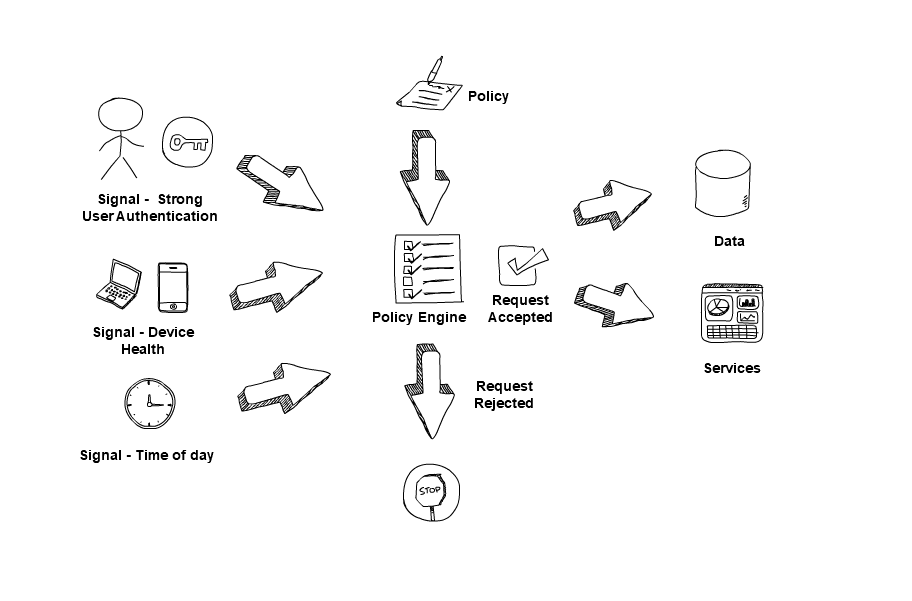

# 4. Use policies to authorise requests

Each request for data or a service should be authorised against a policy. The power of a zero-trust architecture comes from the access policies you define.

Use products and protocols that support a continuous authentication and authorisation process, whilst protecting your data at rest and in transit with encryption. How you achieve this depends on the of zero trust technologies you deploy.

For example, in a cloud environment, access may be controlled using an authentication and authorisation broker to provide Single sign-on (SSO) functionality to a variety of applications, with enforcement usually being session-based. Policies will be assessed as a connection is established, and if approved, the broker will provide a short-lived session token allowing access to the service requested by the user.

Regardless of how you design your zero trust architecture, a component that enforces access policy should only allow connections if the policies you define are satisfied.

It\'s important that you trust a product or service that enforces access policy and ensure it has been designed with zero trust in mind. If this component was compromised, it would give the attacker control over who has access to data or services.

**Use signals to make access decisions**

Policy decisions should consider several signals, taken from a signals database and real-time connection information. Together, these enable you to build context, so you can decide if an access request can be trusted enough to continue.

Signals from sources such as the user's identity, their devices and user behaviour can be used to make access decisions. For example, a high-impact action, such as creating a new admin-level user, would have to meet stringent policy requirements to be trusted. Whereas, a relatively low-impact action, such as checking the online lunch menu, would have to meet more lenient policy requirements to be trusted.

  

**Buying zero trust technology**

When choosing technologies for your zero-trust architecture, evaluate the signal types they support, as well as other applicable capabilities, for compatibility with your policy engine. Some examples signals that the policy engine could evaluate are the user's role, physical location, authentication factor ,device state, value of the service they are accessing, and risk of the action they are performing.

Some policy engines will allow you to create risk-based access policies, perhaps prompting for additional signals to gain more confidence in the connection. For example, if a user tries to access a high-value service for the first time outside of normal working hours. In this case, the policy engine may ask a user to present a 2nd factor for authentication.

### Other considerations

**Access denied**

When an access request is denied, consider how the user will be informed. Too much information may facilitate an attacker, too little may frustrate a legitimate user. For example, you may indicate that there has been an authentication error, but not detail what has failed, for example, 'the account does not exist.' This makes life difficult for an attacker trying to enumerate authentication information.

**Break glass**

Should an emergency arise where access to data is critical, you may need to have a process in place which allows a connection to be established even if an access policy can\'t be satisfied.

In such a scenario, the risk needs to be managed carefully to prevent this feature being abused. For example, limit the risk associated with emergency access by only allowing such access, from an individual user account, on a specific device, from a specified location, for a limited time, with minimum privilege required.
