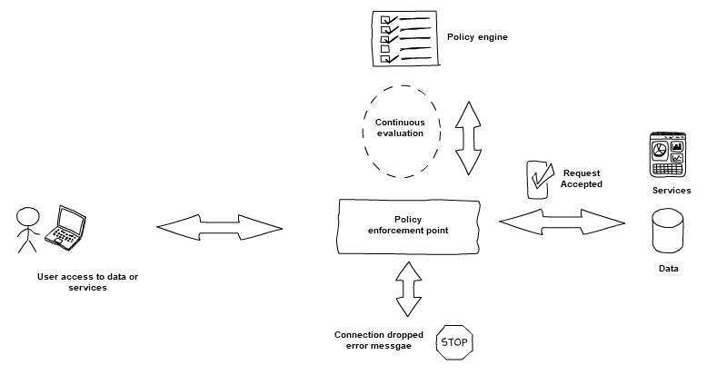
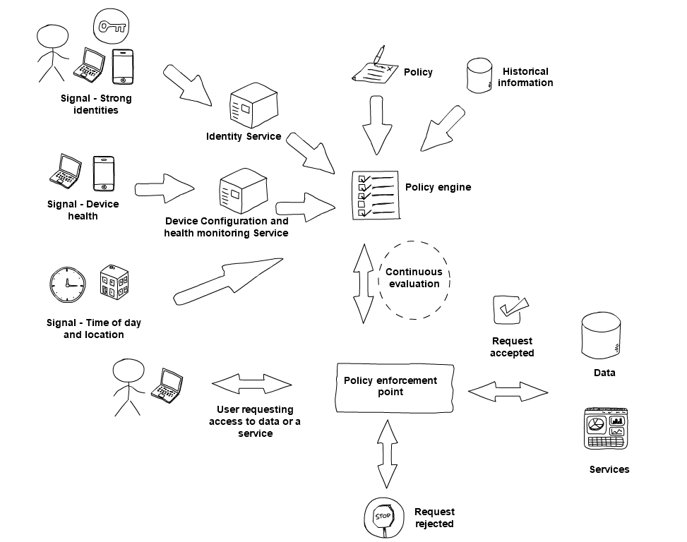

## 4. Use policies to authorise requests.

**Each request for data or services should be authorised against a policy**

The power of a zero trust architecture comes from the access policies you define. Policies can also help to facilitate risk managed sharing of data or services with guest users or partner organisations.

Use products, managed services and protocols that support a continuous authentication and authorisation process.

**Example - access authorised by policy**

Here is a simple theoretical example of a user accessing a service or corporate data, with a policy authorising the request. A more in depth example, expanding on the use of signals in the authorisation process, can be found in Use multiple signals to make access decisions section below

1.  A user makes a connection to a *policy enforcement point*, which will mediate their connection to the service or data requested.

2.  The *policy enforcement point* will query the *policy engine* for an access decision. The *policy engine* will evaluate the request against an access policy before suppling an access decision to the enforcement point.

3.  If the access request is accepted by the *policy engine*, the request is allowed by the *policy enforcement point*. If it\'s rejected by the *policy engine* then the connection is dropped.

4.  The access decision is being continually evaluated in real time. A change in security posture may entail termination of the connection, or re-authentication.

 

How you achieve the use of polices to authorise requests depends on the of zero trust technologies you deploy. For example, zero trust using managed cloud services will be different to an on-premises network.

In some approaches, the names and terminology used may be slightly different to our example above.

**Continuous evaluation**

Continuous evaluation is supported by monitoring signals from users and devices and evaluating them continually. If confidence in their security degrades, re-authentication may be triggered dynamically, before authorising continued access to services and data.

Regardless of how you design your zero trust architecture, the policy engine, or any component that enforces policy, should only allow connections if the strict policies you define are satisfied.

**Protect the policy engine**

It\'s important that you have a high degree of trust in any product or service that enforces your access policy. You should ensure such essential elements of your architecture have been [designed with zero trust in mind.](8-Choose-services-which-have-been-designed-for-zero-trust.md) If this component was compromised, it would give an attacker control over who has access to data or services.

It\'s important that access to the policy engine is restricted to only communicate with trusted policy enforcement points, or services that provide signals, such as a user identity service. It should not communicate with untrusted sources, such as unauthenticated end user devices.

When the policy engine is parsing signals, the source should be from a trusted and known entity which is mutually authenticated. The input should also be validated before parsing. This ensures that no malicious content is consumed by the policy engine. If you are using a policy engine which is a managed service, it is likely the process of securely parsing signals is the responsibility of the service provider.

It\'s also important to protect the policies that are being imported into the policy engine. The ability to restrict who can import a policy to trusted users and also be able to audit and review policies is key.

**Use multiple signals to make access decisions**

Policy decisions should consider several signals, taken from historical information and real-time connection information. Together, these enable you to build context, so you can decide if an access request can be trusted enough to continue. These signals are fed into a policy engine so it can make an informed access decision.

It is important to use several signals to gain confidence in an access request, as this will give more information to analyse and provide greater confidence that the requester is genuine and their device is in good cyber health.

A high-impact action, such as creating a new admin-level user, would have to meet stringent policy requirements to be trusted. Whereas, a relatively low-impact action, such as checking the online lunch menu, would have to meet more lenient policy requirements.

**Example - evaluating signals to a policy engine**

The diagram below describes a theoretical example of how a number of signals are evaluated by a policy engine. Signals and user access (via a policy enforcement point) are continually evaluated by the policy engine.

Depending on your implementation of zero trust and the type of signals used, the details may change, but the principle illustrated here should be the same.

 

**Buying zero trust technology**

When choosing technologies for your zero trust architecture, evaluate the signal types they support, as well as other relevant capabilities, for compatibility with your policy engine.

Some example signals that the policy engine could evaluate are:

-   the user\'s role

-   the user\'s physical location

-   authentication factors

-   device health

-   time of day

-   value of the service to be accessed

-   risk of the action requested

**Risk-based engines**

Some policy engines will allow you to create risk-based access policies, perhaps prompting for additional signals to gain more confidence in the connection.

Risk-based policy engines consider the confidence level of users and devices, dynamically adjusting access policies in response. For example, imagine a user trying to access a high-value service for the first time, outside of normal working hours. In this case, the policy engine may ask a user to present a second factor for authentication.

**Other considerations**

**Denied access**

When an access request is denied, consider how the user will be informed. Too much information may facilitate an attacker, too little may frustrate a legitimate user.

You may indicate that there has been an authentication error, but *not* detail what has failed by saying something like, \'the account does not exist.\' Without such clues, it is much more difficult for an attacker to enumerate authentication information.

**Break glass**

Should an emergency arise where access to data is critical, you may need to have a process in place which allows a connection to be established, even if an access policy can\'t be satisfied. Any use of a break glass procedure should be alerted to a shared medium, such as a group email box or a shared chat channel. This is so any misuse of the credentials can be spotted and timely action taken.

In such a scenario, the risk needs to be managed carefully to prevent this feature being abused. For example, limit the risk associated with emergency access by only allowing such access from an individual user account, on a specific device, from a specified location, for a limited time, with minimum privilege required.

**Availability**

Once you have defined the policies that govern access control to your data and services, you should evaluate whether availability has been affected by mistakenly blocking legitimate access requests.

When a policy has first been defined, start by logging and not denying access, for a small period of time, to ensure the policy is acting as intended. During this evaluation period, it's important that the logs are regularly audited and action is taken promptly if a malicious attempt to access data or a service has occurred.

It could be the case that you require a transition period where your traditional security controls are actively blocking requests, while you are measuring the effectives of the newly defied policies.
